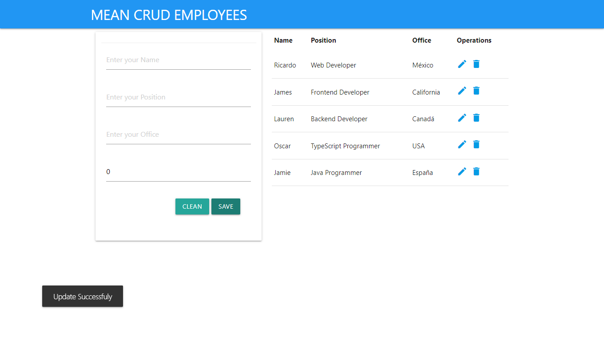
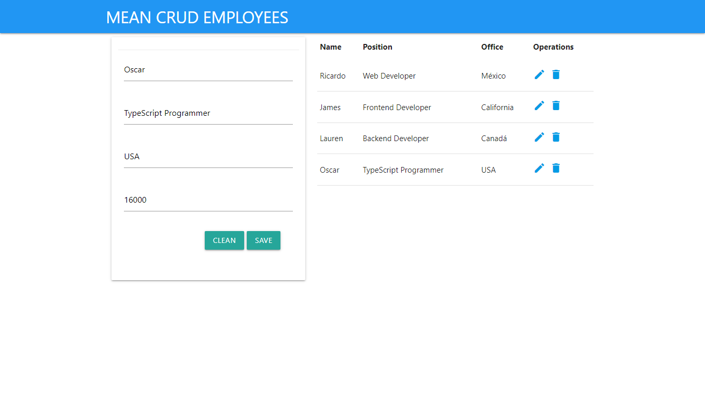

# stackmean-employees-apicrud

Antes de comenzar debes tener instalado Visual studio Code, NodeJS, Git, TypeScript, Angular CLI y mongoDB

Pasos para arrancar el proyecto
1) Abrir una terminal de Git y clonar el proyecto con el comando: git clone https://github.com/RickZF/stackmean-employees-crud.git
2) Abrir una terminal y activar el servicio de mongoDB con el comando: mongod
3) Abrir la carpeta del proyecto con Visual Studio Code y abrir una terminal con ctrl+shift+ñ
4) Moverse a la carpeta server con el comando: cd server
5) Dentro de server instalar las dependencias con el comando: npm install 
6) Dentro de server arrancar el servidor con el comando: npm run dev
7) Abrir otra terminal y moverse a la carpeta client con el comando: cd client
8) Dentro de la carpeta client escribir el comando: npm install
9) Dentro de la carpeta client arrancar el servidor de Angular con el comando: npm run start
10) Abrir el navegador Chrome y en la barra de direcciones escribir http://localhost:4200/
11) Agregar empleados a la base de datos